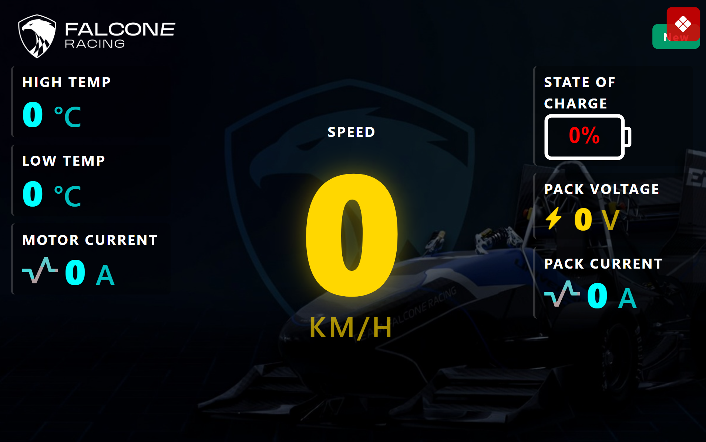
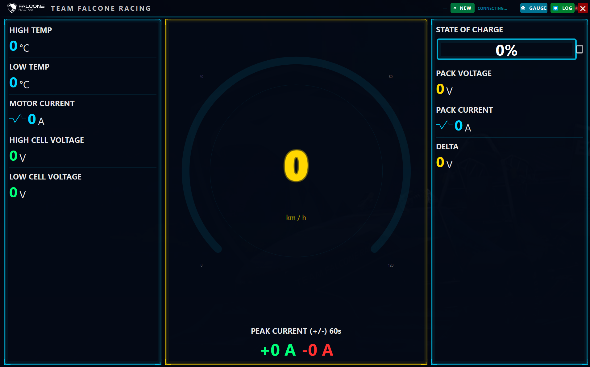

# DisplayCode Repository

This repository contains backend, debug, and frontend implementations for working with CAN-based display data.

## Project Structure

### 1. Backend (Single Main Backend)
- **`main.py`**
- Primary backend entry point for the project.
- Handles the core backend logic.

### 2. Debug Code
- **`Is_messages_recived.py`**
- Debug/validation script used to check whether messages are being received.

### 3. Lightweight Frontend
- **`download_server.py`**
- Lightweight frontend/server-side interface for simple interactions.

### 4. Heavy Frontend
- **`electrone-display-app/`**
- Full Electron-based frontend application for richer UI and heavier client-side functionality.

### 5. DBC Reference (Short Note)
- **`Orion_CANBUS_new2.dbc`**
- Used only as a short reference to understand received CAN frames.

## Quick Start

1. Run backend from `main.py`.
2. Use `Is_messages_recived.py` for message-receive debugging.
3. Use `download_server.py` for lightweight frontend flow.
4. Use `electrone-display-app/` for the full frontend experience.

## UI Comparison

	
	

